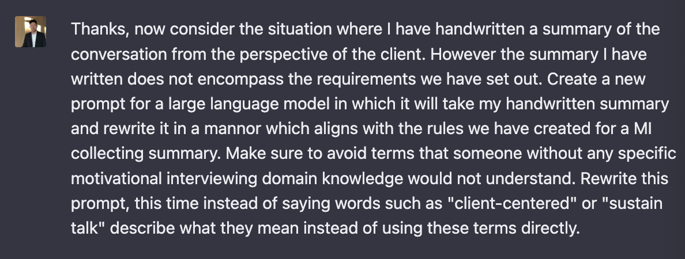

# Designing an MI Aderant Summarization Prompt

## Preview

> Therapist: To start, what is the thing you like most about smoking? 															
>
> Client: I like the feeling I get from it of course, and also, I enjoy the physical act. 									
>
> Therapist: You enjoy the fact that smoking makes you feel calm and relaxed.									
>
> Therapist: Did that make sense? 																													
>
> Client: Yes 																																					
>
> Therapist: Now, what is the thing you like least about smoking? 																
>
> Client: The smell Therapist: You dislike the smell of cigarettes. 																
>
> Therapist: Did what I said make sense to you? 																							
>
> Client: yes 																																					
>
> Therapist: Now, what is one thing about your smoking habit that you would like to change? 					
>
> Client: Nothing actually 																															
>
> Therapist: You want to quit smoking completely. 																					
>
> Therapist: Did that make sense? 																													
>
> Client: no 																																					
>
> Therapist: What will it look like when you have made this change in your smoking habit? 						
>
> Client: I don't want to make a change. 																									
>
> Therapist: You realize that making the change will require discipline and persistence. 							
>
> Therapist: Does this make sense to you? 																										
>
> Client: yes 																																					
>
> Therapist: Finally, what are the steps you need to take to make this change?                         					
>
> Client: Well, if I wanted to smoke less, I suppose I would possibly try to keep myself busy in other ways
>
> Therapist: You realize that it is not just a matter of smoking less, but also of staying busy in other ways. 
>
> Therapist: Did that make sense?          																											
>
> Client: yes

Over the course of this document we'll go over how given the text conversation above we improve our summarization from:

> You enjoy the feeling of calmness and relaxation that smoking brings, but dislike the smell. You don't want to make a change to your smoking habit, but understand that it will require discipline and persistence. To make this change, you plan to keep yourself busy in other ways.

To this:

> It sounds like the thought of changing your smoking habit brings up mixed feelings for you. You enjoy the feeling of calm and relaxation that smoking gives you, but you don't like the smell. You recognize that it will require discipline and persistence to make a change, but it is not something you are currently interested in doing. You are considering ways to keep yourself busy as an alternative to smoking. It sounds like you have thought through the pros and cons of changing, and have come to a decision that you are not ready to make a change right now. What would motivate you to make the change in the future?

## Back to Basics: Relearning Summarization Within MI

### What is a Summary?

- Summaries are essentially reflections that collect what a person has been saying, offering it back as in a basket
- They can be used to pull together what has been said, as at the end of a session and may suggest links between present material and what has been discussed before
- Summaries can also function as a transition from one task to another
- In the engaging and focusing processes of MI, summaries promote understanding and show clients that you have been listening carefully, remembering and valuing what they say
- They also provide a “What else?”opportunity for the person to fill in what you have missed

### What Types of Summaries Exist Within MI?

- Collecting Summaries:

  - A collecting summary recalls a series of interrelated items as they accumulate. Ask an open question like “How might you like your life to be different a year from now?” and you are likely to begin accumulating a list 

  - When you have heard two or three items, pull them together in a collecting summary: 

    > “So one thing you hope will be different a year from now is that you will have a good job, one that you enjoy and brings you in contact with people. You’ve been relating more positively to your children lately, and you would like that to continue. You also said you might like to quit smoking. What else, as you think of where you’d like your life to be a year from now?"

- Linking Summaries

  - A second and related type is a *linking* summary. Here you reflect what the person has said and link it to something else you remember from prior conversation.

    > “You felt really hurt and angry when he didn’t bother to call you back—disrespected in a way. I remember you told me about another time when someone just ignored you and it really set you off.”
    >
    > “You’re really pleased that you managed to exercise every day this week, and you even started feeling a kind of high from running. I wonder if that’s like the way you felt that day when you hiked up to the mountain lake all by yourself.”

- Transitional Summaries

  - A third type is the *transitional* summary, to wrap up a task or session by pulling together what seems important or announce a shift to something new. Again you are choosing what to highlight. A transitional summary often begins with an orienting statement that announces you’re about to tie things together.

    > “Well, you remember I told you that I have some specific questions I would need to ask you before we finish today, but before I do that let me see if I understand what you’re hoping we can help you with here. You need some emergency help with food and safe housing for you and your children. You also would like legal help in getting a restraining order. You already have a primary care doctor but you’d like to have your children see a dentist. Have I missed anything?”

## Knowledge Distilation: Understanding What Makes a Good Summary

- Based on the three types of summaries we can eliminate linking summaries since our conversation does not extend to multiple sessions/conversations
- It would seem our desired summary lies somewhere between a transitional and a collection summary
  - While we aren't pivoting to a new topic we are pulling together what seems important in the conversation thus far
  - Additionally the open questions we've asked may have generated a list of things in the response from the client and thus a collecting summary may be applicable
- We can use this as a launch point to determine a list of things that would make a good summary (all bullet points are paraphrased from various sections of the MI textbook)
  - We want to capture what the client has discussed
    - Should focus on the feelings the client has expressed
    - It should contain important goal-oriented component of the evoking process and is should increase the chances of creating movement in the direction of change
    - Should capture the client's change talk and present it in a way that is consciously directed toward change
  - The summary should have an air of "talk therapy"-ness
    - Summaries should be client-centered in its perspective
    - The summary should not be confrontational
  - Should give the client an opportunity to add to the conversation if anything was missed
    - Should end with an open question intended to elicit further change talk
    - If the client has made plans a summarization of the plan along with a closed ended question focusing on the commitment of the client is acceptable

## Designing a Prototype Prompt

### Leveraging ChatGPT to Help with Prompt Engineering

ChatGPT has become an increasingly more present tool when it comes to improving the productivity across a variety of domains of work. Perhaps it can be of use when it comes to prompt engineering as well. Below is a conversation with ChatGPT discussing Motivational Interviewing and summariation.

We see that ChatGPT understands to some level what motivational interviewing is and what collecting and transitional summaries are.

We see that ChatGPT is able to adequatly condense these bullet points into a single multi-sentence prompt. However some of these terms are domain specific, we want to avoid this as it can lead to misunderstandings from the model.

This looks pretty good! As a bonus, let's fill ChatGPT in on our broader goal and see if it can tweak this in a way if feels is better aligned as a prompt.

You'll notice that we've also tweaked the framing of the problem such that it takes the summary generated from our MVP solution to decrease the complexity of the problem. Great, lets put this to the test.

### Testing ChatGPT's Prompt on ChatGPT

The way ChatGPT works is it's intended to be more humanable in its responses perhaps more importantly its main purpose is to hold extended conversations and retain and leverage information from throughout the conversation. As an initial proof of concept a fresh chat was started with ChatGPT to ensure it could not leverage prior parts of our conversation. 

Seeing as this was quite successful, a natural follow up question arrises, "could this prompt do even better if we gave it the full context of the conversation?". Perhaps our original summaries left something out. This time we reframe the prompt and pass in the entire text transcript and include our summary as the final message, renaming BOT to therapist and USER to client to better fit the problem. We now ask the model to rework the final message from the therapist. Additionally we add in the client's responses to the therapist's reflections, hoping the model may choose to leverage this information. Notably, the mvp summary solution does not use this information.

​																				**. . . . .**

This result also seems quite promising! The tone and diction also seem more warmer than the prior output when we only provided the mvp summary. This may be due to the inclusion of the broader conversation which has a much stronger "therapy" energy and thus helps prime the model in the direction we want.

Let's take this one final step further, lets now remove the mvp summary all together and slightly rephrase the prompt again, this time asking it to generate a follow-up message summarizing the conversation from scratch.

Although the letter format is not what we're looking for the context it contains captures the context of the conversation and properly weaves the MI summary qualities we're looking for!

## Extending the Prototype to Davinci-003

While the results on ChatGPT were extreamly promising, due to a lack of ChatGPT APIs a ChatGPT solution is not realistic. As such we turn back to Davinci-003 and see how this prompt plays out there.

However a direct transfer does not yeild strong results as seen in this result from Playground.

> Imagine that you are the therapist in this conversation with someone who's struggling with a smoking addiction, the last message you sent is a summary of the conversation so far but the summary doesn't meet the requirements for a summary expected in a talk therapy environment from a professional therapist. Rewrite the last message you sent, here are some guidelines to help you rewrite the summary in a way that's more effective:
> - Focus on the person's feelings and experiences, and show that you understand and accept what they're going through. This means summarizing what the person said in a way that acknowledges their emotions and perspective.
> - Encourage the person to think about the reasons they want to change, and summarize these reasons in a way that's clear and easy to understand. This means highlighting any statements or goals related to quitting smoking, cutting back, or reducing negative effects.
> - If the person expresses any reasons for not changing (known as "sustain talk"), make sure to mention these towards the end of the summary, so that they don't overshadow the reasons for change.
> - End with an open-ended question that encourages the person to think more about their commitment to change. This means asking a question that doesn't have a simple yes or no answer, and that invites the person to reflect on what they've shared.
>
> Therapist: To start, what is the thing you like most about smoking?
> Client: I like the feeling I get from it of course, and also, I enjoy the physical act.
> Therapist: You enjoy the fact that smoking makes you feel calm and relaxed.
> Therapist: Did that make sense?
> Client: Yes
> Therapist: Now, what is the thing you like least about smoking?
> Client: The smell
> Therapist: You dislike the smell of cigarettes.
> Therapist: Did what I said make sense to you?
> Client: yes
> Therapist: Now, what is one thing about your smoking habit that you would like to change?
> USER: Nothing actually
> Therapist: You want to quit smoking completely.
> Therapist: Did that make sense?
> Client: no
> Therapist: What will it look like when you have made this change in your smoking habit?
> Client: I don't want to make a change.
> Therapist: You realize that making the change will require discipline and persistence.
> Therapist: Does this make sense to you?
> Client: yes
> Therapist: Finally, what are the steps you need to take to make this change?
> Client: Well, if I wanted to smoke less, I suppose I would possibly try to keep myself busy in other ways
> Therapist: You realize that it is not just a matter of smoking less, but also of staying busy in other ways.
> Therapist: Did that make sense?
> Client: yes
> Therapist: You enjoy the way smoking calms you, but dislike the smell of cigarettes. You want to make a conscious choice to quit smoking, realizing that it is harmful to your health and that you need to make changes to improve your appearance. You understand that making these changes will require your willpower.
>
> Does this summary of our conversation capture your thoughts and feelings accurately?

It seems that davinci-003 does not have the same human-like qualities that ChatGPT does. As such commands such as "imagine you are a ..." does not yeild the positive results as it does in ChatGPT. Additionally, perhaps the bullet points were confusing to the model. Rewording the prompts yeilds better results. A number of different prompts ultimately resulted in the one below:

> Write a reply from the perspective of the therapist summarizing the conversation so far. Focus on the client's feelings and experiences, and show that you understand and accept what they're going through. Summarize what the client said in a way that acknowledges their emotions and perspective. Encourage the client to think about the reasons they want to change, and summarize these reasons in a way that's clear and easy to understand. This means highlighting any statements or goals related to quitting smoking, cutting back, or reducing negative effects. End with an open-ended question that encourages the client to think more about their commitment to change by asking a question that doesn't have a simple yes or no answer, and that invites the client to reflect on what they've shared. The conversation is as follows:

This new prompt has undergone a number of changes:

- Bullet point on sustain talk was removed to simplify the task
- The prompt is much more "matter of fact" rather than human worded where we contextualize a story
- "Someone" and "person" was replaced with "client" to better match it to the conversation transcript

## Takeaways

We see from this sequence of experiments that Davinci-003 holds the potential to generate effective MI-aderent summaries that meet the quality we are seeking however we have yet to test this across a larger collection of data to fully verify if our current prompt is sufficient.

Additionally, we recognize that our current text transcripts actually removed too much information. By keeping in the client's response to "did that make sense", it helped provide a more accurate summary.

## Next Steps

### Run the Prompt Across the Standard 20 Chat Conversations

During the time of this writing all publicly facing OpenAI services have gone offline due to an internal server error. As such further experiements on this current prompt were unable to take place. Doing these experiments when these services return will help solidify the effectiveness of this prompt.

### Begin to Move to MI V5.2 Conversations

Currently all work done has been on MI V5.1 conversations which are less complex than the V5.2 conversations. If we hope to encorporate this summarization into the ChatBot we'll need to make sure our solution works for the most up-to-date conversations.

### Check How Our Summarization Classifier Does On These New Summaries

We should check if these new summaries break our classifier or if it still works as expected. If it is broken we should consider training or updating our model to be able to classify these summaries. Perhaps this time we may choose to say our previous mvp summarizations should be classified as bad summaries now that we've raised our standards.

### Investigate Results of a Finetuned Model

Lastly, this new prompt involves the most tokens we've used in a model query yet. If we plan to use this model in the future in the interest of throughput it would be useful to see if we could create a model that is able to generate these summaries given the text conversation without any prompts. To do this we will need to drastically expand the number of conversations we're working with.

