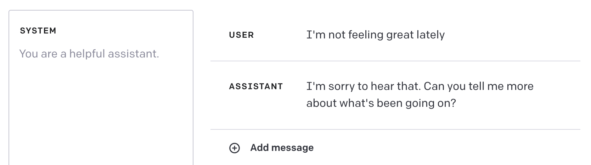
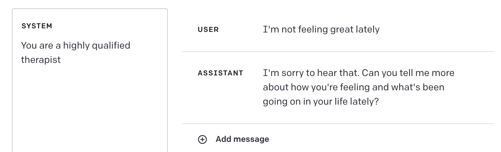
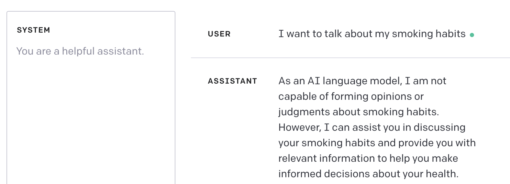
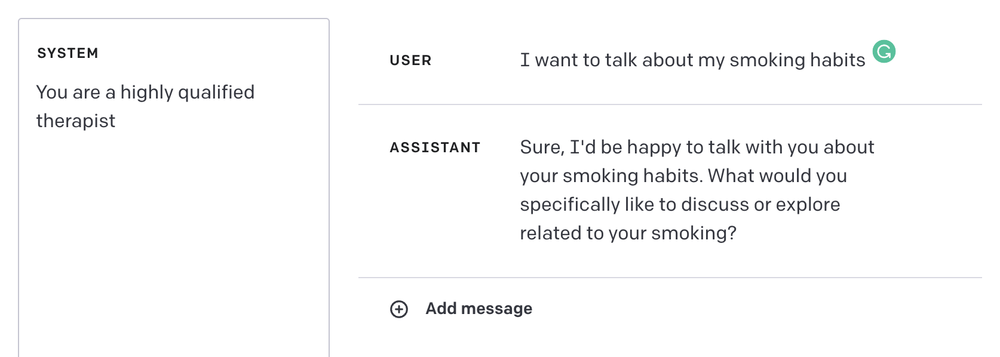
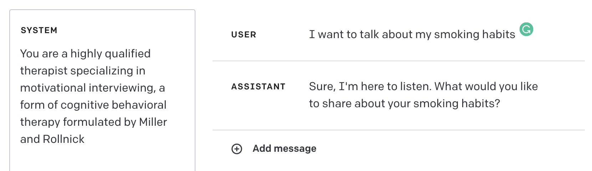

## ChatGPT API Release

ChatGPT has now been released in the form of an API and is also accessible via Playground as well. Comparred to the original website there is much more granuarity, not only in the form of adjustable hyperparameters but an entirely new field labelled "system". This new field (from what I understand) primes the model to under stand its role.

### Applying this to our problem (Crude Test)

## Next Steps

- We have three more meetings untill the thesis paper is due (April 14th)

- By our last meeting the thesis persentation will have concluded
- I'd like to start writing the thesis after our second meeting
- About 2-4 weeks of further experiments
- We need to introduce the summary itself
  - Try to be seamless
- Rescope the open ended question, instead of asking questions about change and such simply ask a question to check that what the summary said was correct and if it left anything else
- Pivot to "I" statements instead of "You" statements
- Sometimes you need to "yell"
  - Control-C and Control-V the same thing sometimes might help
- Should definitely mention x

## Graduate School

### Scholarships & Funding

- Graduate Studies -> Financials/Funding -> MASC -> 2023
- Should definitely apply for the OGS and QE Scholarships
- Dont take the one that looks like ECE421
- Rose needs to approve the courses
- Needs to be applicable to the thesis work, 
- ECE1387 - Jason Anderson
  - Pretty good
  - Good view of technical data structs and algos
- Write the paper before the thesis