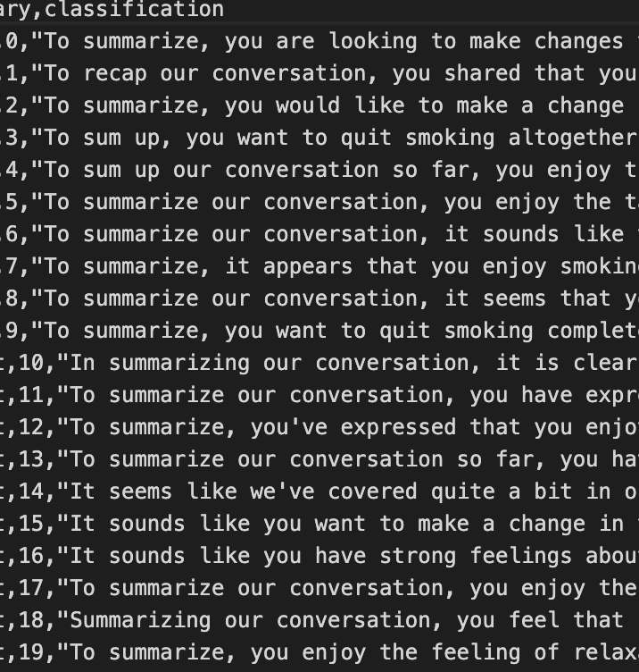
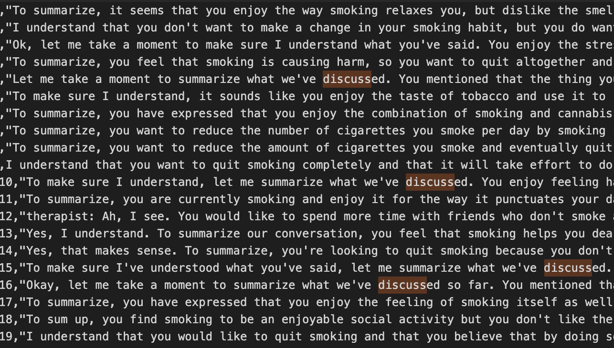
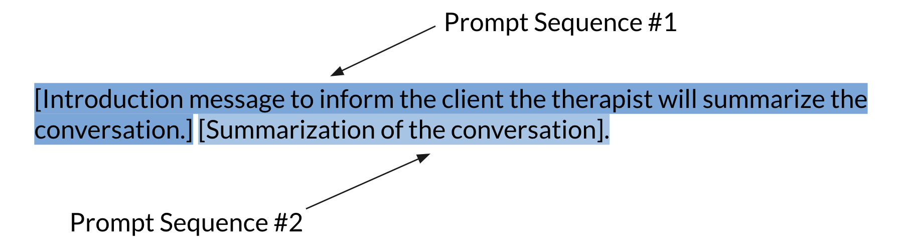
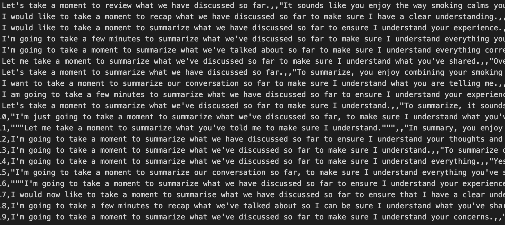
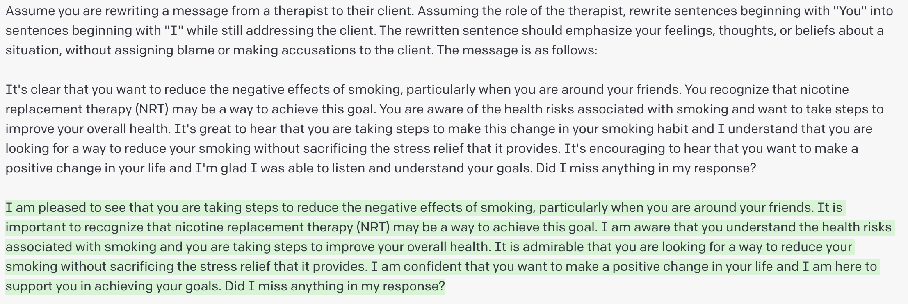
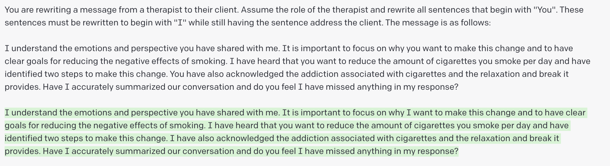
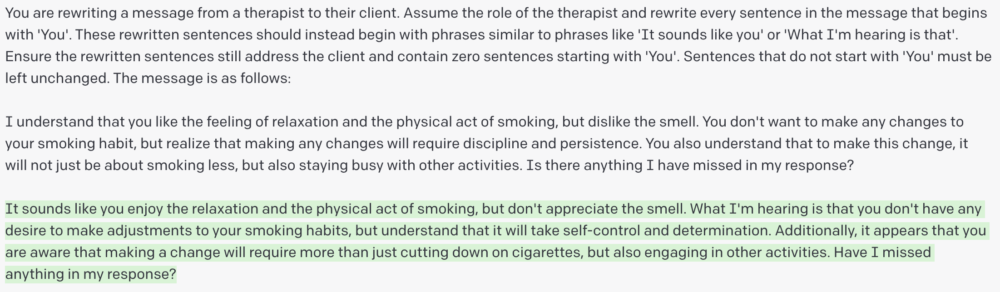

# The Final Stretch of Improvements

As the school year begins to wind to an end as does this undergraduate thesis. Picking up from where we left off we now have a solid prompt thanks to [Designing MI Driven Summaries](Designing-MI-Driven-Summaries.md). From our meeting with CAMH theripists we recieved a lot of valuable feedback. However much of which requires too much of a overhaul to fit into the remaining bandwidth available. 

The main points of improvement were captured in [Final Stretch Plans](Final-Stretch-Plans.md) and are as follows:

1. Rescope the open ended question, instead of asking questions about change and such simply ask a question to check that what the summary said was correct and if it left anything else
2. The summary should open with a notice/disclaimer that we will be summarizing so the client is aware of what the purpose of this message is
3. Pivot to "I" statements instead of "You" statements

All of these points are directly informed by CAMH feedback.

## The Current Prompt

As a refresher, the current prompt is shown bellow:

> Write a reply from the perspective of the therapist summarizing the conversation so far. Focus on the client's feelings and experiences, and show that you understand and accept what they're going through. Summarize what the client said in a way that acknowledges their emotions and perspective. Encourage the client to think about the reasons they want to change, and summarize these reasons in a way that's clear and easy to understand. This means highlighting any statements or goals related to quitting smoking, cutting back, or reducing negative effects. End with an open-ended question that encourages the client to think more about their commitment to change by asking a question that doesn't have a simple yes or no answer, and that invites the client to reflect on what they've shared. The conversation is as follows:
>
> <data>

## Redesigning the Open Ended Question

While questions which follow up on a client's commitment, change talk, or potential plans is useful it should exist outside of our summary. We will be adopting the kinds of questions during a transitional summary which serve to simply check that the summary was accurate and give the client a change to add anything they feel was missed.

**General bug:** Sometimes responses will include the speaker and start with "Therapist: ", a simple fix to resolve it but was worthwhile to mention. 

### Attempt #1

> Write a reply from the perspective of the therapist summarizing the conversation so far. Focus on the client's feelings and experiences, and show that you understand and accept what they're going through. Summarize what the client said in a way that acknowledges their emotions and perspective. Encourage the client to think about the reasons they want to change, and summarize these reasons in a way that's clear and easy to understand. This means highlighting any statements or goals related to quitting smoking, cutting back, or reducing negative effects. End by asking the client a question that gauges whether this summary adequately captures the conversation and if the client would like to add anything the therapist missed. The conversation is as follows:
>
> <data>

This attempt worked well however it seemed to seperate 

### 3_19_1_mega_prompt_2

- Questions were "voiceless"
  - "Is there anything else you would like to add to this summary?"
  - Too objective perhaps?

### 3_19_1_mega_prompt_2

- Issues where questions seemed to increase the scope rather than wrap the conversation up
  - "Is there anything else you want to add that might help you achieve your goal?"

### 3_19_1_mega_prompt_3

- Still hitting questions which increase scope
  - What do you think is the most important reason why you want to make this change?

### 3_19_1_mega_prompt_6

Hypothesis: Asking it to come up with a "question" is making it work harder than it needs to, remove this. Additionally the question should be rephrased to simply ask for anything missing rather than if there is anything that should be added

- Questions are much more in line with "is there anything else"
- Still having some questions show up as
  - " Additionally, is there anything else you would like to discuss when it comes to changing your smoking habit?"

### 3_19_1_mega_prompt_7

> Write a reply from the perspective of the therapist summarizing the conversation so far. Focus on the client's feelings and experiences, and show that you understand and accept what they're going through. Summarize what the client said in a way that acknowledges their emotions and perspective. Encourage the client to think about the reasons they want to change, and summarize these reasons in a way that's clear and easy to understand. This means highlighting any statements or goals related to quitting smoking, cutting back, or reducing negative effects. Finishing by asking the client if anything was missed in your reply before ending this conversation. This question must not ask the client to discuss new topics and only serves to verify nothing was missed in your response. The conversation is as follows:

Hypothesis: Instead of finding a good sentence to explain what we want, add a sentence in addition explaining what we don't want

- This works quite well and questions only seem to be asking if the client wants to add or discuss anything that was missed in the summary
- "Anything I missed" might be leading to model to scope up

## Adding a Preface For The Summary

Feedback from CAMH suggests that the current summary is a bit abrupt. There needs to be a sentence that establishes a break in the conversation and that now the "therapist" will be taking a step back to summarize the conversation so far.

### 3_19_1_preface_long_prompt_1

Results are passable though it feels very robotic. Adding more explination in what this sentence should convey could help improve quality.

 ### 3_19_1_preface_long_prompt_2

Adding explination did not seem to help by much. It felt as though the model was too eagar to jump to summarizing the conversation.

### 3_19_1_preface_long_prompt_4

Hypothesis: The current prompt instructs GPT to summarize. Perhaps results will improve if we swap the order of the instructions.

> Before
>
> Write a reply from the perspective of the therapist ==summarizing the conversation so far==. First, reply with a sentence aimed at informing the client that you will now take a moment to summarize the conversation so far to ensure you understand everything the client has said. Focus on the client's feelings and experiences, and show that you understand and accept what they're going through. Summarize what the client said in a way that acknowledges their emotions and perspective. Encourage the client to think about the reasons they want to change, and summarize these reasons in a way that's clear and easy to understand. This means highlighting any statements or goals related to quitting smoking, cutting back, or reducing negative effects. Finishing by asking the client if anything was missed in your reply before ending this conversation. This question must not ask the client to discuss new topics and only serves to verify nothing was missed in your response. The conversation is as follows:

> After
>
> Write a reply from the perspective of the therapist. First, write a single sentence that informs the client you will now take a moment to summarize the conversation you've had to make sure you understand what the client has said. ==Now summarize the conversation so far keeping in mind the following guidelines==. Focus on the client's feelings and experiences, and show that you understand and accept what they're going through. Summarize what the client said in a way that acknowledges their emotions and perspective. Encourage the client to think about the reasons they want to change, and summarize these reasons in a way that's clear and easy to understand. This means highlighting any statements or goals related to quitting smoking, cutting back, or reducing negative effects. Finishing by asking the client if anything was missed in your reply before ending this conversation. This question must not ask the client to discuss new topics and only serves to verify nothing was missed in your response. The conversation is as follows:

These results are much better! Well, some of them. Unfortunately the results are very inconsistent. When it's able to work we get great results like "Let me tke a moment to summarize what we've discussed". When it isn't we get things like "To summarize, ..." or no mentions of summarization at all.

### 3_20_MPA_1 (Important Nomenclature Changes)

**Hypothesis:** Previously we demonstrated the power of a longer summary. Here however it seems like as we add more instructions we *can* get better results but it is not a certainty. I would postulate that given a single task (summarize) adding more details can result in a powerful result. However trying to add more instructions to expand the scope of the task seems to quickly fall apart.

**Solution:** Previously we introduced the idea of prompt sequences in [Designing An MVP](Designing-An-MVP.md). Now let us introduce prompt phases. Intuitively, it shouldn't be hard to get a state of the art generative language model to output a message indicating to a reader they are about to summary a conversation. So let us seperate these two problems into seperate prompt sequences that operate in isolation. Note that prompt sequences can contain just one prompt.

This now allows us to increase the ambition of our task of generating a powerful MI aderant summary response without pushing too much complexity in the form of additional tasks into a single prompt sequence.

Here is the new prompt strategy:

> Prompt Sequence #1:
>
> "As a therapist provide a single sentence explaining to your client that you will now take a moment to summarize your conversation with them to ensure you understand what the client has said so far."
>
> Prompt Sequence #2:
>
> "Write a reply from the perspective of the therapist summarizing the conversation so far. Focus on the client's feelings and experiences, and show that you understand and accept what they're going through. Summarize what the client said in a way that acknowledges their emotions and perspective. Encourage the client to think about the reasons they want to change, and summarize these reasons in a way that's clear and easy to understand. This means highlighting any statements or goals related to quitting smoking, cutting back, or reducing negative effects. Finishing by asking the client if anything was missed in your reply before ending this conversation. This question must not ask the client to discuss new topics and only serves to verify nothing was missed in your response. The conversation is as follows:"

The results from this are very promising as we maintain the results from **3_19_1_mega_prompt_7** which has a good summary followed by our redesigned closing question and ensure we have a sentence prefacing the summary every generation. Additionally, this allows us to test individual prompt sequences and could save on overall R&D cost in the long run.

## Converting into You Statements

Leveraging our new prompt strategy, we can now increase the complexity of our summarization prompt sequence without tampering with our prompt sequence for generating an initial preface message.

Here is the new prompt strategy:

> Prompt Sequence #1:
>
> "As a therapist provide a single sentence explaining to your client that you will now take a moment to summarize your conversation with them to ensure you understand what the client has said so far."
>
> Prompt Sequence #2:
>
> "Write a reply from the perspective of the therapist summarizing the conversation so far. Focus on the client's feelings and experiences, and show that you understand and accept what they're going through. Summarize what the client said in a way that acknowledges their emotions and perspective. Encourage the client to think about the reasons they want to change, and summarize these reasons in a way that's clear and easy to understand. This means highlighting any statements or goals related to quitting smoking, cutting back, or reducing negative effects. Finishing by asking the client if anything was missed in your reply before ending this conversation. This question must not ask the client to discuss new topics and only serves to verify nothing was missed in your response. The conversation is as follows:"
>
> <Additional prompt to convert You statements into I statements>

Unsuprisingly, prompts which leverage technical terms performs poorly:

### 3_20_MAP4

However, defining these terms and rewriting the prompt shows promise:

Adding this prompt into prompt sequence #2 reduces the number of total "You" statement across 20 conversations from 32 to 14. Not a perfect result but definitely a notable improvement. It should be mentioned however that some of these modified sentences sound a bit stiff.

### 3_20_MAP5

Adding some more specificity to the prompt reduces the number of "You" statements from 32 to 6 across 20 conversations.

Is this few shot learning? Objectively it is not however I am providing the model with suggestions and we can observe cases where the model uses these suggestions verbatum. However I believe since these are simply glorified transitional phrases, some repetition/static-ness is acceptable and is far supperior to the previously stiff sounding rewritten sentences.

# The End Result

Here's what we started with when we began writing up this document:

> Throughout our conversation, you've shared that you like the feeling you get when you smoke and the physical act of smoking, but that you don't like the smell. You want to quit smoking completely, and understand that it will require discipline and persistence. You have identified the need to keep yourself busy in other ways, in order to reduce the urge to smoke. This is an important step in making the change you want to see in your smoking habit. It sounds like you have some clear goals in mind, and you understand that it will take effort to make this change. Can you tell me more about why it is important for you to make this change?

Here's where we've gotten through our various improvements and overhauls outlined in this document:

> I would like to take a moment to summarize our conversation and ensure that I understand what you have shared with me. It sounds like you find the physical and mental relaxation that smoking brings satisfying, but you don't like the smell. What I'm hearing is that you don't want to make any changes to your smoking habit, but you do recognize that making the change will require discipline and persistence. To accomplish this, you want to focus on staying busy in other ways to reduce the urge to smoke. Is there anything else related to this topic that you wanted to discuss that I may have missed?

You are rewriting a message from a therapist to their client. Assume the role of the therapist and rewrite every sentence in the message that begins with 'You' such that no rewritten sentence begins with 'You'. These rewritten sentences should instead begin with phrases similar to phrases like 'It sounds like you' or 'What I'm hearing is that'. Ensure the rewritten sentences still address the client. Sentences that do not start with 'You' must be left unchanged. The message is as follows:

